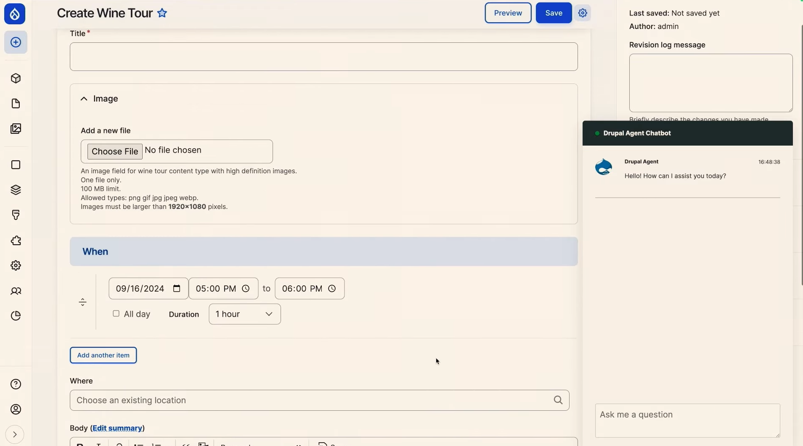
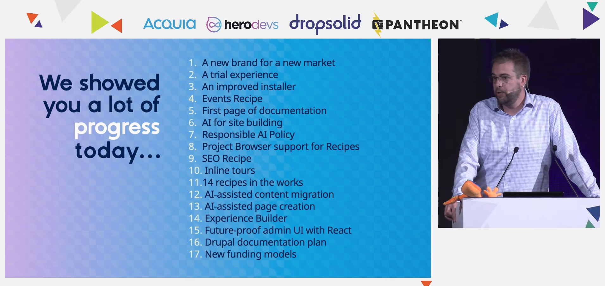
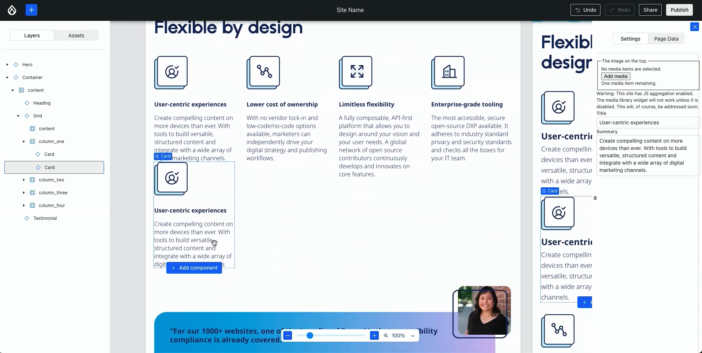
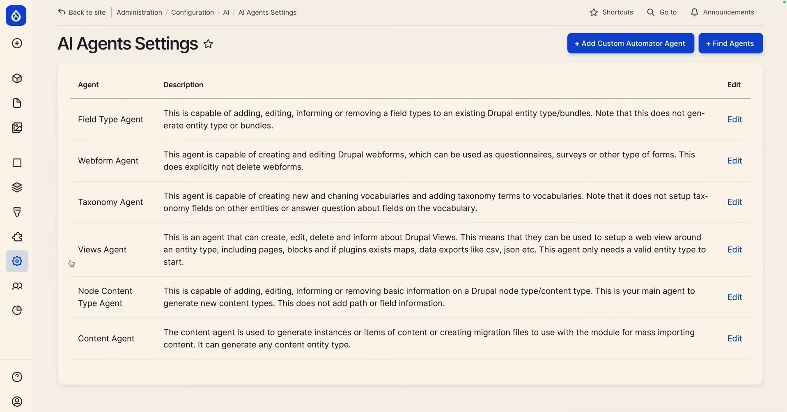
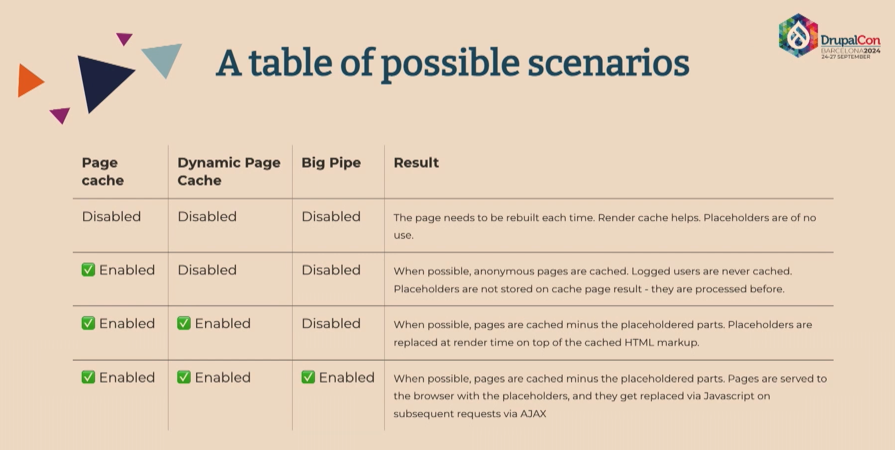

# Driesnote: DrupalCon Barcelona 2024

This keynote covered the progress of the **Starshot Initiative**, now officially known as **Drupal CMS**, which is focused on making **Drupal more accessible** for non-developers, such as content creators and marketers, while retaining its flexibility for developers. The session detailed the project’s goals, milestones, and the roadmap leading up to the first major release.

A major focus is the integration of **AI-powered features**, allowing users to perform tasks using **natural language commands**. **AI agents** help with operations like **managing content types**, **configuring fields**, and **migrating content**, making Drupal easier for non-technical users.

*Driesnote: AI assisted Drupal*

*Driesnote: Progress of Drupal CMS.*

### Key takeaways:

- **Drupal CMS for non-developers**: Aimed at empowering non-technical users, Drupal CMS is optimized for those who want to build and manage sites without requiring developer assistance, focusing on no-code and low-code workflows.
- **AI-powered features**: AI agents now assist with tasks like renaming content types, adding fields, and even content migration. This makes Drupal easier to use by allowing users to interact in natural language, improving accessibility for non-technical users.
- **Phase 1 release**: The official launch of Drupal CMS 1.0 is set for January 15, 2025, coinciding with Drupal's 24th birthday. Phase 2 will expand features like the Experience Builder and deepen AI integration.
- **Collaboration**: Over 14 recipes are in development, offering reusable solutions that combine modules, configurations, and best practices to streamline site building. 

### Link to video:

https://www.youtube.com/watch?v=nhPiL4g972A&list=PLpeDXSh4nHjQOfQV-BUgoxHXlr4tHlhPO&index=5

# Experience Builder Initiative

This session covered Drupal's upcoming **Experience Builder**, a tool designed to **simplify content creation and design**, targeting both **non-technical users** and **developers**. The tool aims to **reduce the complexity** and **cost of creating and maintaining Drupal sites** by providing a **low-code interface** for building pages, components, and templates. The focus is on making Drupal more **user-friendly** and **competitive with other platforms** by improving the experience for **content creators**, **developers**, and **designers**.

*Demo of Experience Builder.*

*Experience Builder timeline.*

### Key takeaways:

1. **Simplified content creation**: Experience Builder provides a low-code interface for building and editing pages without heavy developer involvement.
2. **Component-based design**: Users can create reusable components and templates, improving efficiency and design consistency.
3. **User-focused design**: The tool supports content creators, developers, and designers, making site management more accessible to non-technical users.
4. **Cost and complexity reduction**: Experience Builder addresses issues like high development costs and Drupal’s perceived complexity, making it more competitive.
5. **Planned release dates**: Stable release Q3 2025, and final release Q4 2025.

### Link to video:

https://www.youtube.com/watch?v=hYP-YEbJI-E&list=PLpeDXSh4nHjQOfQV-BUgoxHXlr4tHlhPO&index=56

### Mentioned modules:

- Experience Builder: https://www.drupal.org/project/experience_builder
- Single Directory Components: https://www.drupal.org/docs/develop/theming-drupal/using-single-directory-components

# AI with Drupal - Using LLM technology is easy, but how do you actually build useful applications?

This session provided a clear breakdown of how **large language models (LLMs)** like **OpenAI’s GPT** can be integrated into **Drupal** to create practical, **AI-driven applications**. It focused on **simplifying AI** by explaining that these models are essentially **advanced text generators**, not intelligent beings. The session covered how **AI can be used effectively** for tasks like **content generation**, **answering queries**, and **personalizing user experiences**. It also discussed practical considerations such as **cost optimization**, **dynamic data retrieval**, and how to build on top of **pre-trained AI models** instead of creating your own.

*"Identifying useful applications"*

### Key takeaways:

1. **AI is a predictive tool, not a thinker**: Large language models generate text based on statistical patterns in data, making them effective for generating relevant responses, but not truly intelligent.
2. **No need to train your own model**: Training an AI model from scratch is expensive and unnecessary for most cases. Instead, leverage existing models like GPT and build on top of them.
3. **Embeddings for semantic search**: Embeddings (vector representations of text) allow for more accurate semantic search by enabling the system to find related content even when exact keywords aren't used. This is done by converting text into vectors and calculating their similarity.
4. **Dynamic data input (RAG)**: Use Retrieval Augmented Generation (RAG) to dynamically pull in relevant data in real-time, improving efficiency and reducing token costs.
5. **Cost and performance optimization**: Reducing token usage by limiting the amount of data sent to the model and using smaller models for simpler tasks is key to controlling costs.

### Link to video:

https://www.youtube.com/watch?v=wrAWjMiJrXo&list=PLpeDXSh4nHjQOfQV-BUgoxHXlr4tHlhPO&index=82

### Mentioned modules:

- AI (Artificial Intelligence): https://www.drupal.org/project/ai

# Drupal AI: Once again leading the way with the new golden era of the web

This session explored the **Drupal AI module**, explaining its **origins**, **current functionality**, and **future direction**. The module was created to address the growing **fragmentation of AI tools** within the Drupal community. Various standalone AI modules existed, but there was no **unified approach**. The team behind this project aimed to bring **AI integration into a single, cohesive module** that could serve as the backbone for **AI-driven workflows in Drupal**, offering developers more streamlined and consistent solutions.

At present, the module leverages **AI agents** to handle tasks such as **automating content creation**, **building Webforms**, and **improving search functionality** through **semantic embeddings**. One of its strengths is the **abstraction layer**, which allows users to **seamlessly integrate different AI providers**, such as **OpenAI** or **AWS Bedrock**, giving developers **flexibility in choosing the best tools** for their needs. The goal is to make **AI a central part of Drupal's future**, helping developers **automate complex processes** and **reduce manual tasks**.

*Demo of AI agents in Drupal*

### Key takeaways:

- **Unifying AI efforts in Drupal**: The module was created to consolidate the fragmented AI tools in the Drupal ecosystem into a single, cohesive system.
- **AI agents for automation**: AI agents can automate tasks such as content creation, form building, and smart search, reducing manual workloads for developers.
- **Flexible integration with AI providers**: The abstraction layer allows seamless switching between AI providers, including OpenAI and AWS Bedrock, offering flexibility for developers.
- **Expanding future capabilities**: Plans to develop more advanced features, such as content migration, AI-powered e-commerce, and complex workflow automation, making AI an integral part of Drupal’s evolution.

### Link to video:

https://www.youtube.com/watch?v=C7kZsemZJDo&list=PLpeDXSh4nHjQOfQV-BUgoxHXlr4tHlhPO&index=60

### Mentioned modules:

- AI (Artificial Intelligence): https://www.drupal.org/project/ai
- AI agents: https://www.drupal.org/project/ai_agents

### Other links

- AI agent setup by OSTraining: https://www.youtube.com/watch?v=4S-HBFVE2lU
- AI agent setup by FreelyGive: https://www.youtube.com/watch?v=hptyElqmo6Q

# Single Directory Components - A new web of possibilities

This session introduced **Single Directory Components (SDC)**, a new feature in **Drupal 10.1** that allows developers to bundle all files related to a **UI component** (template, CSS, JavaScript) into a **single directory**. This **modular approach** simplifies development, enhances **reusability**, and makes components easier to manage. **SDC** also promotes better **separation of concerns**, making testing and collaboration more efficient.

*SDC example.*

### Key takeaways:

- **Bundled components for easy management**: SDC allows developers to package all related files (templates, CSS, JavaScript) in one directory, streamlining both development and maintenance.
- **Improved reusability and modularity**: SDC supports a modular approach, making it easy to reuse components across multiple projects, reducing the need to rebuild similar elements.
- **Separation of concerns**: By isolating components, SDC simplifies testing, as each component is self-contained and does not depend on other parts of the system.
- **Collaboration-friendly**: The self-contained nature of components makes collaboration easier among teams, as each component can be developed and tested in isolation.

### Mentioned modules:

- SDC Story Generator: https://www.drupal.org/project/sdc_story_generator
- SDC Examples: https://www.drupal.org/project/sdc_examples
- SDC Block: https://www.drupal.org/project/sdc_block
- UI Patterns: https://www.drupal.org/project/ui_patterns
- Radix theme: https://www.drupal.org/project/radix

### Other links

- Single Directory Components: https://www.drupal.org/docs/develop/theming-drupal/using-single-directory-components
- ShadCN UI: https://ui.shadcn.com/
- V0.dev Chat: https://v0.dev/chat

# Drupal Recipes Initiative Update

This session introduced the **Recipes initiative** in **Drupal**, a new approach to applying **reusable configurations** that address the limitations of traditional **install profiles** and **distributions**. Recipes allow developers to apply and share configurations without locking users into rigid systems. The session covered the progress of the initiative, including the completion of **Phase 1**, which has integrated recipes as an **experimental API** in **Drupal core**, and the upcoming goals for **Phase 2**, which will further enhance the flexibility and power of this system.

*Anatomy of a recipe.*

*Recipe structure.*

### Key takeaways:

- **Modular configuration**: Recipes allow site builders to mix and match configurations, which are stored as YAML files, offering flexibility in how features are added or removed from sites. Recipes can include module installations, configuration actions, and even content.
- **Broader integration plans**: Future improvements will see more Drupal profiles, like the Standard and Umami profiles, converted to recipes. This shift will provide a more flexible approach to setting up Drupal sites, allowing site builders to choose features more dynamically.
- **Phase 1 completion**: Phase 1 successfully introduced Recipes as an experimental API in Drupal 10.3 and will continue in Drupal 11. It enabled developers to create reusable recipes using YAML files. The core functionality includes applying configurations for modules and themes.
- **Phase 2 goals**: The next phase will focus on enhancing the Recipes API by supporting more complex workflows. This includes enabling “unpacking” recipes, so once a recipe is applied, its dependencies remain in the site even if the recipe is removed. Phase 2 will also look into better user input options, dynamic configurations, and improved UI integration with the Project Browser for easier recipe discovery and application.

### Link to video:

https://www.youtube.com/watch?v=623lKSpQB9U&list=PLpeDXSh4nHjQOfQV-BUgoxHXlr4tHlhPO&index=18

### Other links

- Recipes Cookbook: https://www.drupal.org/docs/extending-drupal/contributed-modules/contributed-module-documentation/distributions-and-recipes-initiative/recipes-cookbook
- Recipes documentation on Git: https://git.drupalcode.org/project/distributions_recipes/-/tree/1.0.x/docs

# Lazy Loading Content for Better Performance, User Experience, and SEO

This session focused on the use of **lazy loading** and **caching strategies** in Drupal to improve site performance, user experience, and SEO. The talk explored how **lazy builders**, **placeholders**, and **BigPipe** help optimize **Core Web Vitals** like **Largest Contentful Paint (LCP)** and **Cumulative Layout Shift (CLS)**, which are critical for SEO and the user experience. The discussion also emphasized understanding Drupal’s caching system and managing cache invalidation effectively to maintain fast and efficient web pages.

*Different caching scenarios.*

### Key Takeaways:

- **Caching challenges**:
  - A single cache miss can slow down the entire page, so it's important to identify and optimize weak elements.
  - Be mindful of cache contexts like user sessions and languages, as they can cause high cache variations (cardinality), leading to inefficiency.
- **Lazy builders and placeholders**:
  - **Lazy builders** (`#lazy_builder`) allow rendering dynamic content later to improve performance. Use `#create_placeholder` to force placeholders for certain components to be filled in once content is ready.
- **Core Web Vitals**:
  - Avoid using placeholders for **Largest Contentful Paint (LCP)** elements like hero images to prevent poor loading performance.
  - Use **placeholder previews** (`#lazy_builder_preview`) to prevent **Cumulative Layout Shift (CLS)**.
- **Dynamic Page Cache and BigPipe**:
  - Enabling **Dynamic Page Cache** and **BigPipe** serves static content immediately, while deferring dynamic content. This is especially effective for logged-in users.
  - For anonymous users, **BigPipe Sessionless** helps optimize the first request by caching it for subsequent hits.
- **Cache control**:
  - Customize `auto_placeholder_conditions` to control caching behavior. Tools like **Cache Review** and **Cache Metrics** help track cache invalidations and optimize performance.

### Link to video:

https://www.youtube.com/watch?v=FgKHi0qQKe0&list=PLpeDXSh4nHjQOfQV-BUgoxHXlr4tHlhPO&index=15

### Mentioned modules:

- **Cache Control Override**: https://www.drupal.org/project/cache_control_override
- **Ajax BigPipe**: https://www.drupal.org/project/ajax_big_pipe
- **BigPipe Sessionless**: https://www.drupal.org/project/big_pipe_sessionless
- **Cache Review**: https://www.drupal.org/project/cache_review
- **BigPipe Demo**: https://www.drupal.org/project/big_pipe_demo
- **Cache Metrics**: https://www.drupal.org/project/cache_metrics

### Tips

- **Lazy builder**: `#lazy_builder` – For delayed content rendering.
- **Placeholder previews**: `#lazy_builder_preview` – For handling placeholders without causing layout shifts.
- **Create placeholder**: `#create_placeholder` – To force the creation of placeholders for dynamic content.

# Running a fleet of websites with ease on the LocalGov Drupal Microsites platform

This session covered the **LocalGov Drupal Microsites platform**, which enables managing multiple websites through a single Drupal installation. It focused on how the platform simplifies managing microsites for councils, ensuring consistent branding, accessibility, and easy customization. 

*Sheffield City Council's main site and four (4) micro sites.*

### Key takeaways:

1. **Centralized management**: One Drupal installation handles multiple microsites, reducing overhead.
2. **Tailored user access**: Admins and editors have specific roles, ensuring content control.
3. **Customizable design**: Built-in tools make it easy to adjust themes and layouts.
4. **Extensive use cases**: Suitable for councils, universities, and corporations with multiple websites.

### Link to video:

https://www.youtube.com/watch?v=kl51vy3_K1Q&list=PLpeDXSh4nHjQOfQV-BUgoxHXlr4tHlhPO&index=92

### Mentioned modules:

- Group module: https://www.drupal.org/project/group
- Group sites module: https://www.drupal.org/project/group_sites
- Domain access module: https://www.drupal.org/project/domain
- Layout paragraphs module: https://www.drupal.org/project/layout_paragraphs

### Distributions mentioned:

- LocalGov Drupal: https://www.drupal.org/project/localgov
- LocalGov Drupal Microsites: https://www.drupal.org/project/localgov_microsites

# Honourable mentions

## Edit Together: Collaborative Editing for Everyone

This open-source solution offers **real-time editing** with **multiple users**, **threaded commenting**, and integration with Drupal’s content moderation workflows.

*Edit together tool demo.*

### Other links

Edit Together by Palantir: https://www.palantir.net/edittogether